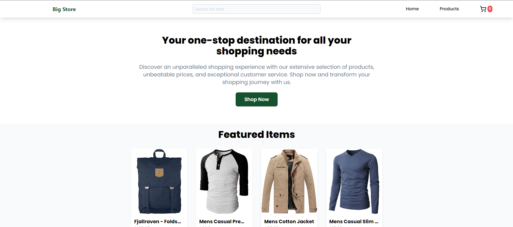

<h1>the odin project: Shopping cart Project</h1>

built using <a href="https://fakestoreapi.com">fakestore API</a>, React.js with vite, Tailwind.css , Eslint and prettier config

<h4>this project covers: </h4>
<ul>
    <li>React OSP concept</li>
    <li>React routing</li>
    <li>State managment using Context API</li>
    <li>React proptypes checking</li>
    <li>front end data fetching with external API(fakestore API)</li>
</ul>

